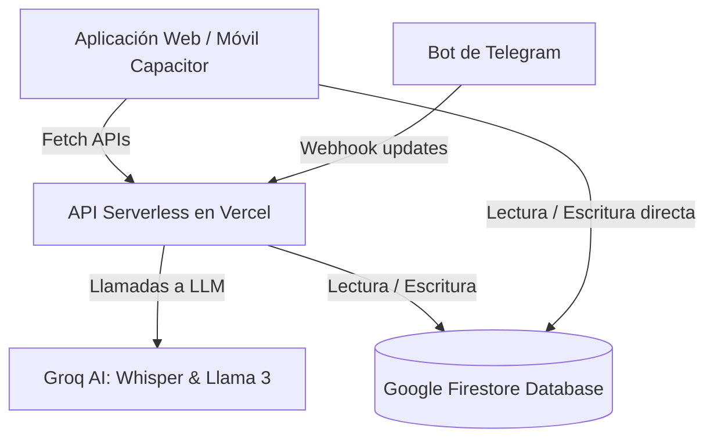

# DOCUMENTACIÓN DEL SISTEMA: GESTOR DE GASTOS INTELIGENTE

Este documento detalla la arquitectura, el diseño de la base de datos, el flujo de procesamiento de voz y texto con Inteligencia Artificial, y el funcionamiento general del **Gestor de Gastos**.

---

## 1. Arquitectura General

El sistema está construido como una aplicación híbrida de finanzas personales que combina una interfaz web/móvil con un bot conversacional de Telegram.



*   **Frontend (Cliente web/móvil)**: Desarrollado en **Next.js** y compilado como una SPA estática (`output: 'export'`) cargada por **Capacitor** para funcionar nativamente en Android y iOS.
*   **Servidor Backend (APIs y Webhooks)**: Funciones Serverless de Next.js que corren en **Vercel** cuando el proyecto es desplegado en producción.
*   **Base de Datos**: **Firebase Firestore** para sincronización en tiempo real y persistencia.
*   **Autenticación**: **Firebase Authentication** (correo/contraseña).
*   **Procesamiento de Lenguaje Natural**: Modelos de **Groq Cloud API** (`whisper-large-v3` para transcripción de audio y `llama3-70b-8192` para estructuración y extracción de entidades en formato JSON).

---

## 2. Estructura de la Base de Datos (Firestore)

El sistema utiliza cuatro colecciones principales:

### `users` (Configuración de Usuario)
Contiene la configuración de categorías e ID de Telegram de cada usuario.
*   `telegramId` *(string, opcional)*: El identificador único de chat del usuario en Telegram.
*   `telegramState` *(string, opcional)*: El estado de la conversación con el bot (ej: `editing_123`).
*   `expenseCategories` *(array de strings)*: Lista personalizada de categorías de gastos.
*   `incomeCategories` *(array de strings)*: Lista personalizada de categorías de ingresos.

### `accounts` (Cuentas Financieras)
Fuentes de dinero del usuario (ej: Efectivo, Banco, Tarjeta).
*   `userId` *(string)*: ID del usuario creador.
*   `nombre` *(string)*: Nombre de la cuenta (Efectivo, Banco, etc.).
*   `saldo` *(number)*: Balance actual disponible.
*   `createdAt` *(timestamp)*: Fecha de creación.

### `transactions` (Transacciones de Dinero)
Registra todos los movimientos de ingresos, gastos y transferencias.
*   `userId` *(string)*: ID del usuario.
*   `tipo` *(string)*: Puede ser `'gasto'`, `'ingreso'` o `'transferencia'`.
*   `monto` *(number)*: Valor monetario absoluto de la transacción.
*   `descripcion` *(string)*: Detalle del movimiento.
*   `categoria` *(string)*: Categoría asociada (ej: Alimentación, Salario, etc.).
*   `accountId` *(string, opcional)*: ID de la cuenta afectada (para gastos e ingresos).
*   `fromId` *(string, opcional)*: ID de la cuenta origen (solo para transferencias).
*   `toId` *(string, opcional)*: ID de la cuenta destino (solo para transferencias).
*   `timestamp` *(timestamp)*: Fecha de ejecución de la transacción.
*   `fuente` *(string)*: Canal de registro (`'web'`, `'telegram_voice'`, `'telegram_text'`).

### `linkingCodes` (Códigos de Vinculación con Telegram)
Almacena códigos temporales generados en la web para conectar la cuenta con Telegram.
*   `userId` *(string)*: ID del usuario en Firebase.
*   `createdAt` *(timestamp)*: Fecha de creación.
*   `expiresAt` *(timestamp)*: Fecha de expiración (5 minutos de validez).
*   `used` *(boolean)*: Indica si ya fue canjeado por el bot.

---

## 3. Procesamiento Inteligente con IA (Groq)

Tanto el bot de Telegram como la entrada de voz de la aplicación móvil utilizan el mismo motor de IA definido en `src/services/groq.ts`.

### Flujo de Registro por Voz
1.  El usuario graba un audio en Telegram o presiona el **botón de micrófono** en la app móvil.
2.  El audio se envía en formato binario a las APIs correspondientes (`/api/webhook` o `/api/voice-input`).
3.  El audio se envía al modelo **Whisper (Groq)**, que retorna la transcripción textual del audio.
4.  La transcripción se procesa con **Llama 3** a través de un prompt altamente especializado para estructurar la transacción en formato JSON:

```json
{
  "items": [
    {
      "monto": 15.00,
      "tipo": "gasto",
      "categoria": "Comida",
      "cuenta": "Efectivo",
      "descripcion": "almuerzo ejecutivo"
    }
  ]
}
```

### Reglas del Prompt (LLM Rules)
-   **Contexto de Centavos Continuo**: Si el usuario dicta varios montos en secuencia (ej: *"gasté 25 centavos en el bus luego 45 y después 35"*), la IA hereda la magnitud del primer centavo e interpreta $0.25, $0.45 y $0.35 secuencialmente.
-   **Búsqueda Inteligente para Correcciones**: Extrae parámetros de cambio (`montoAnterior`, `categoriaAnterior`, `cuentaAnterior`) para reclasificar o editar gastos antiguos en comandos correctivos (ej: *"era comida no cine"* o *"era 15 no 10"*).

---

## 4. Funcionamiento del Bot de Telegram (`/api/webhook`)

El bot es una instancia de `Telegraf` montada en una ruta POST serverless. Realiza las siguientes tareas de forma reactiva:
*   **Comando `/vincular <code>`**: Valida el código de vinculación temporal en Firestore, asocia el `telegramId` al usuario creador y marca el código como usado.
*   **Mensaje de Texto o Voz Ordinario**: Transcribe (si es voz), estructura con la IA e inserta la transacción directamente en Firestore, decrementando o incrementando el saldo de la cuenta indicada en tiempo real.
*   **Comandos de Edición y Reclasificación**:
    -   *Edición*: Si dictas *"era 15 no 10"*, busca la transacción con monto 10, revierte el saldo de 10 de la cuenta y aplica el nuevo saldo con el monto de 15.
    -   *Reclasificación*: Si dictas *"era comida no cine"*, busca la transacción de categoría "Cine" y le actualiza la categoría a "Comida".
    -   *Búsqueda inteligente*: Busca coincidencias por monto, categoría previa, o recae en la transacción más reciente del usuario si no hay parámetros específicos.

---

## 5. Entrada de Voz en la Aplicación Móvil (`/api/voice-input`)

Para permitir la entrada de voz dentro del celular sin pasar por Telegram, implementamos el siguiente flujo:
1.  **Grabación**: En `page.tsx` el componente utiliza `MediaRecorder` para capturar el audio del micrófono del teléfono en un Blob.
2.  **Envío a API**: Se envía por FormData a la ruta `/api/voice-input`.
3.  **Resolución de Dominio (`getApiUrl`)**: Capacitor no soporta rutas relativas. La utilidad `src/lib/api.ts` detecta si la app corre dentro del contenedor nativo y redirige las llamadas al endpoint absoluto en Vercel (`https://gastos-delta-pearl.vercel.app/api/voice-input`).
4.  **Confirmación Auditada**: En lugar de guardar silenciosamente la transacción, la app abre el modal de **Agregar Movimiento** o **Transferencia** con los campos autocompletados por la IA. El usuario valida los datos visualmente y los guarda manualmente.

---

## 6. Gestión de Categorías e Iconos Personalizados

El componente en `src/app/ajustes/page.tsx` ofrece una experiencia fluida para la edición y visualización de categorías:
*   **Pestañas de Selección (Tabs)**: Permite cambiar entre la lista de categorías de **Gastos** e **Ingresos**.
*   **Edición en Sitio (Rename)**: Al hacer clic en el lápiz editor de cualquier categoría, la etiqueta se convierte en un campo de texto interactivo. Al presionar *Enter* o desenfocar el campo, el nombre se actualiza en el perfil de Firestore, impactando al instante los selectores del dashboard y modales.
*   **Mapeador Dinámico de Iconos (`CategoryIcon.tsx` y `AccountIcon.tsx`)**: 
    - Las categorías predeterminadas se muestran con imágenes 3D de alta definición de estilo *claymorphism* (optimizados a 96x96 píxeles, ~10KB cada uno, para garantizar una carga instantánea).
    - Para las categorías personalizadas sin icono 3D, el sistema las mapea dinámicamente usando un badge vectorial con gradientes HSL coloridos e iconos de Lucide (ej: `isSvg: true` en `AVAILABLE_ICONS`).
    - Al presionar el botón de icono en Ajustes, el usuario puede asignar un icono a cualquier categoría. Esto se almacena en Firestore dentro del documento del usuario (`users/${uid}`) bajo el mapa `categoryIcons` (ej: `{ "Golosinas": "golosinas" }`).

---

## 7. Arquitectura de Construcción y Conectividad Híbrida (Vercel & APK)

Para que el frontend en el celular (APK/Capacitor) pueda interoperar con la base de datos y las APIs serverless de Vercel de manera transparente, implementamos:

### A. Exclusión de Rutas de API en Compilación Local (`scripts/build.js`)
*   Capacitor requiere compilar la aplicación como una SPA estática (`output: 'export'`). Sin embargo, Next.js no permite tener rutas API dinámicas (`route.ts`) dentro de un proyecto que se exporta de forma estática.
*   Para solucionarlo, creamos el script de Node.js `scripts/build.js` que se ejecuta en el comando `npm run build`:
    1.  Mueve temporalmente la carpeta `src/app/api` fuera de `src/app` (renombrándola a `src/api-temp`) si no está construyendo en Vercel.
    2.  Ejecuta la compilación estática de Next.js (`next build`) para exportar la SPA limpia para la APK en la carpeta `/out`.
    3.  Restaura de inmediato la carpeta `src/app/api` en su ubicación original en un bloque `finally` para evitar alterar el repositorio.
*   En Vercel (donde `process.env.VERCEL === "1"`), el script simplemente ejecuta `next build` conservando las APIs para que se compilen como funciones serverless dinámicas.

### B. Configuración CORS Condicional
*   Capacitor ejecuta el código de la app móvil bajo un host local (`http://localhost` o `capacitor://localhost`). Para evitar que las peticiones a la API en Vercel sean bloqueadas por políticas de seguridad del navegador del móvil (CORS), configuramos en `next.config.ts`:
    - Inyección dinámica de cabeceras de control de acceso `Access-Control-Allow-Origin: *` y métodos (`POST, GET, OPTIONS, etc.`) exclusivamente en las rutas `/api/*` cuando se despliega en producción en Vercel.

### C. Permisos Nativos de Android y Robustez en Carga
*   **Micrófono nativo**: Añadimos los permisos `<uses-permission android:name="android.permission.RECORD_AUDIO" />` y `MODIFY_AUDIO_SETTINGS` en `AndroidManifest.xml` para que el sistema operativo Android dispare el popup de solicitud de permisos al presionar el micrófono por primera vez.
*   **Evitar Carga Infinita**: Aseguramos la recuperación de estados en Ajustes envolviendo los métodos asíncronos de Firestore en `try/catch/finally`, garantizando que el spinner de carga se oculte siempre y se usen categorías fallback en caso de fallos de red.

---

## 8. Sistema de Versionamiento de la App
*   Centralizamos la versión de la aplicación en `src/lib/version.ts` como `2.1.0`.
*   Esta versión se inyecta dinámicamente en el sidebar de navegación lateral en computadoras, y en el pie de página de la pantalla de **Ajustes** en la APK para que el usuario pueda auditar el estado de su versión instalada.
*   El archivo de configuración de Android (`android/app/build.gradle`) incrementa su `versionCode` a `2` y su `versionName` a `"2.1.0"` para que el sistema operativo móvil reconozca la actualización y no genere conflictos al instalar la APK.

---

## 9. Asesor Financiero IA (Diagnóstico e Inteligencia)

Implementamos un motor de análisis financiero inteligente utilizando el modelo `llama-3.3-70b-versatile` de Groq en la ruta `/api/analysis/route.ts`. 

### Flujo de Análisis
1.  **Datos Recopilados**: Carga el saldo de las cuentas, calcula el total de ingresos y gastos del mes en curso y extrae el desglose de gastos agrupado por categorías.
2.  **Solicitud a la IA**: El servidor ejecuta un prompt diseñado con un rol de Asesor Financiero experto (GESTOR.AI) enfocado en finanzas latinoamericanas. La IA evalúa la salud del presupuesto, calcula el porcentaje de ahorro real, detecta la categoría de mayor consumo y devuelve **3 consejos personalizados accionables**.
3.  **Visualización**:
    *   **En la APK**: Añadimos la sección "Asesor Financiero IA" en el Dashboard principal que abre un modal con el diagnóstico formateado en Markdown.
    *   **En Telegram**: Al mandar el comando "mi saldo" o "saldos", el bot retorna una respuesta enriquecida (vía `{ parse_mode: "Markdown" }`) mostrando los balances, los totales del mes y el diagnóstico financiero de la IA inmediatamente debajo.
