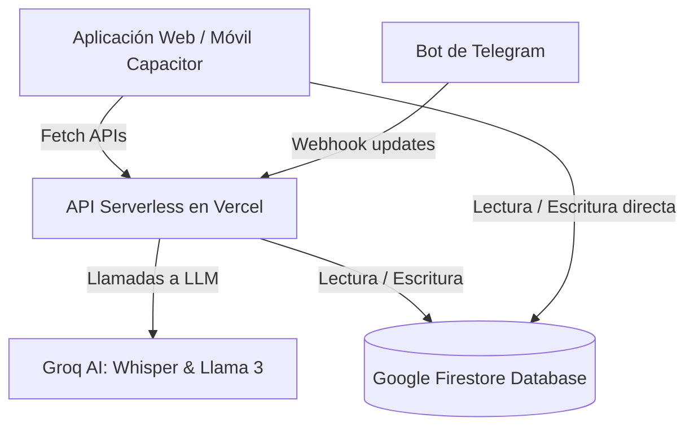

# DOCUMENTACIÓN DEL SISTEMA: GESTOR DE GASTOS INTELIGENTE

Este documento detalla la arquitectura, el diseño de la base de datos, el flujo de procesamiento de voz y texto con Inteligencia Artificial, y el funcionamiento general del **Gestor de Gastos**.

---

## 1. Arquitectura General

El sistema está construido como una aplicación híbrida de finanzas personales que combina una interfaz web/móvil con un bot conversacional de Telegram.



*   **Frontend (Cliente web/móvil)**: Desarrollado en **Next.js** y compilado como una SPA estática (`output: 'export'`) cargada por **Capacitor** para funcionar nativamente en Android y iOS.
*   **Servidor Backend (APIs y Webhooks)**: Funciones Serverless de Next.js que corren en **Vercel** cuando el proyecto es desplegado en producción.
*   **Base de Datos**: **Firebase Firestore** para sincronización en tiempo real y persistencia.
*   **Autenticación**: **Firebase Authentication** (correo/contraseña).
*   **Procesamiento de Lenguaje Natural**: Modelos de **Groq Cloud API** (`whisper-large-v3` para transcripción de audio y `llama3-70b-8192` para estructuración y extracción de entidades en formato JSON).

---

## 2. Estructura de la Base de Datos (Firestore)

El sistema utiliza cuatro colecciones principales:

### `users` (Configuración de Usuario)
Contiene la configuración de categorías e ID de Telegram de cada usuario.
*   `telegramId` *(string, opcional)*: El identificador único de chat del usuario en Telegram.
*   `telegramState` *(string, opcional)*: El estado de la conversación con el bot (ej: `editing_123`).
*   `expenseCategories` *(array de strings)*: Lista personalizada de categorías de gastos.
*   `incomeCategories` *(array de strings)*: Lista personalizada de categorías de ingresos.

### `accounts` (Cuentas Financieras)
Fuentes de dinero del usuario (ej: Efectivo, Banco, Tarjeta).
*   `userId` *(string)*: ID del usuario creador.
*   `nombre` *(string)*: Nombre de la cuenta (Efectivo, Banco, etc.).
*   `saldo` *(number)*: Balance actual disponible.
*   `createdAt` *(timestamp)*: Fecha de creación.

### `transactions` (Transacciones de Dinero)
Registra todos los movimientos de ingresos, gastos y transferencias.
*   `userId` *(string)*: ID del usuario.
*   `tipo` *(string)*: Puede ser `'gasto'`, `'ingreso'` o `'transferencia'`.
*   `monto` *(number)*: Valor monetario absoluto de la transacción.
*   `descripcion` *(string)*: Detalle del movimiento.
*   `categoria` *(string)*: Categoría asociada (ej: Alimentación, Salario, etc.).
*   `accountId` *(string, opcional)*: ID de la cuenta afectada (para gastos e ingresos).
*   `fromId` *(string, opcional)*: ID de la cuenta origen (solo para transferencias).
*   `toId` *(string, opcional)*: ID de la cuenta destino (solo para transferencias).
*   `timestamp` *(timestamp)*: Fecha de ejecución de la transacción.
*   `fuente` *(string)*: Canal de registro (`'web'`, `'telegram_voice'`, `'telegram_text'`).

### `linkingCodes` (Códigos de Vinculación con Telegram)
Almacena códigos temporales generados en la web para conectar la cuenta con Telegram.
*   `userId` *(string)*: ID del usuario en Firebase.
*   `createdAt` *(timestamp)*: Fecha de creación.
*   `expiresAt` *(timestamp)*: Fecha de expiración (5 minutos de validez).
*   `used` *(boolean)*: Indica si ya fue canjeado por el bot.

---

## 3. Procesamiento Inteligente con IA (Groq)

Tanto el bot de Telegram como la entrada de voz de la aplicación móvil utilizan el mismo motor de IA definido en `src/services/groq.ts`.

### Flujo de Registro por Voz
1.  El usuario graba un audio en Telegram o presiona el **botón de micrófono** en la app móvil.
2.  El audio se envía en formato binario a las APIs correspondientes (`/api/webhook` o `/api/voice-input`).
3.  El audio se envía al modelo **Whisper (Groq)**, que retorna la transcripción textual del audio.
4.  La transcripción se procesa con **Llama 3** a través de un prompt altamente especializado para estructurar la transacción en formato JSON:

```json
{
  "items": [
    {
      "monto": 15.00,
      "tipo": "gasto",
      "categoria": "Comida",
      "cuenta": "Efectivo",
      "descripcion": "almuerzo ejecutivo"
    }
  ]
}
```

### Reglas del Prompt (LLM Rules)
-   **Contexto de Centavos Continuo**: Si el usuario dicta varios montos en secuencia (ej: *"gasté 25 centavos en el bus luego 45 y después 35"*), la IA hereda la magnitud del primer centavo e interpreta $0.25, $0.45 y $0.35 secuencialmente.
-   **Búsqueda Inteligente para Correcciones**: Extrae parámetros de cambio (`montoAnterior`, `categoriaAnterior`, `cuentaAnterior`) para reclasificar o editar gastos antiguos en comandos correctivos (ej: *"era comida no cine"* o *"era 15 no 10"*).

---

## 4. Funcionamiento del Bot de Telegram (`/api/webhook`)

El bot es una instancia de `Telegraf` montada en una ruta POST serverless. Realiza las siguientes tareas de forma reactiva:
*   **Comando `/vincular <code>`**: Valida el código de vinculación temporal en Firestore, asocia el `telegramId` al usuario creador y marca el código como usado.
*   **Mensaje de Texto o Voz Ordinario**: Transcribe (si es voz), estructura con la IA e inserta la transacción directamente en Firestore, decrementando o incrementando el saldo de la cuenta indicada en tiempo real.
*   **Comandos de Edición y Reclasificación**:
    -   *Edición*: Si dictas *"era 15 no 10"*, busca la transacción con monto 10, revierte el saldo de 10 de la cuenta y aplica el nuevo saldo con el monto de 15.
    -   *Reclasificación*: Si dictas *"era comida no cine"*, busca la transacción de categoría "Cine" y le actualiza la categoría a "Comida".
    -   *Búsqueda inteligente*: Busca coincidencias por monto, categoría previa, o recae en la transacción más reciente del usuario si no hay parámetros específicos.

---

## 5. Entrada de Voz en la Aplicación Móvil (`/api/voice-input`)

Para permitir la entrada de voz dentro del celular sin pasar por Telegram, implementamos el siguiente flujo:
1.  **Grabación**: En `page.tsx` el componente utiliza `MediaRecorder` para capturar el audio del micrófono del teléfono en un Blob.
2.  **Envío a API**: Se envía por FormData a la ruta `/api/voice-input`.
3.  **Resolución de Dominio (`getApiUrl`)**: Capacitor no soporta rutas relativas. La utilidad `src/lib/api.ts` detecta si la app corre dentro del contenedor nativo y redirige las llamadas al endpoint absoluto en Vercel (`https://gastos-delta-pearl.vercel.app/api/voice-input`).
4.  **Confirmación Auditada**: En lugar de guardar silenciosamente la transacción, la app abre el modal de **Agregar Movimiento** o **Transferencia** con los campos autocompletados por la IA. El usuario valida los datos visualmente y los guarda manualmente.

---

## 6. Gestión de Categorías

El componente en `src/app/ajustes/page.tsx` se rediseñó para ofrecer una experiencia fluida:
*   **Pestañas de Selección (Tabs)**: Permite cambiar entre la lista de categorías de **Gastos** y **Ingresos**.
*   **Creación y Borrado**: Permite añadir categorías separadas por comas e interactuar con Firestore.
*   **Edición en Sitio (Rename)**: Al hacer clic en el lápiz editor de cualquier categoría, la etiqueta se convierte en un campo de texto interactivo. Al presionar *Enter* o desenfocar el campo, el nombre se actualiza en el perfil de Firestore, impactando al instante los selectores del dashboard y modales.
